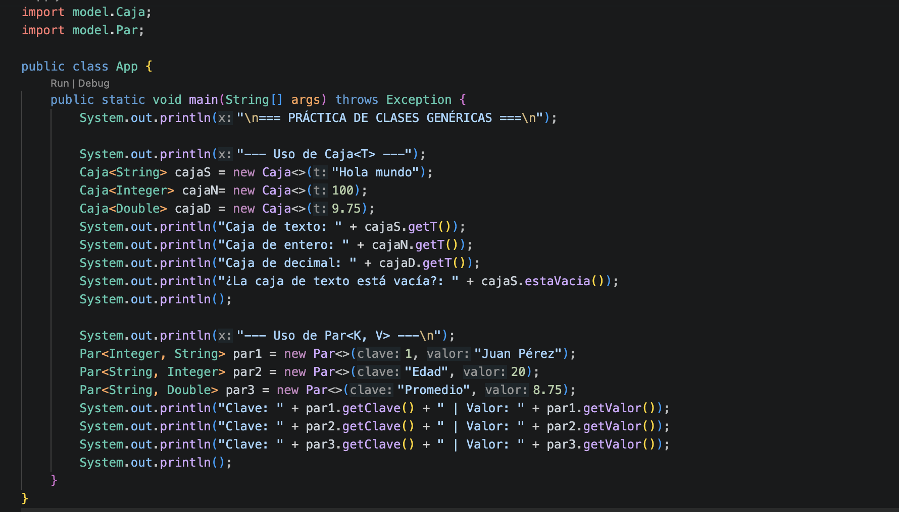
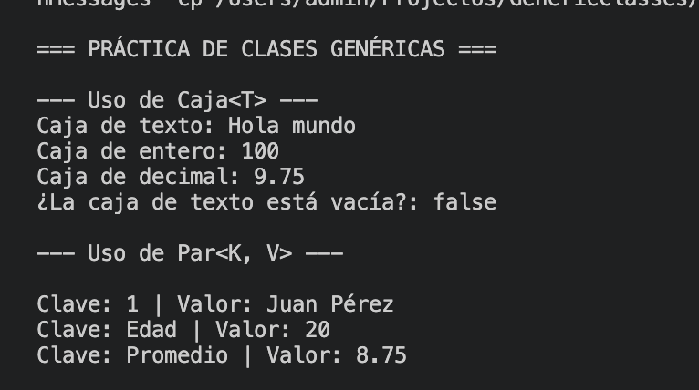

# Práctica: Clases Genéricas en Java

## Datos del Estudiante
- **Nombre:** Jordan Sagbay
- **Curso:** Grupo 3 
- **Fecha:** 02-06-2026

---

## 1. Implementación de Caja<T> y Par<K, V>

**Fecha:** [02-06-2026]
**Descripción:** En esta práctica se implementaron las clases genéricas Caja<T> y Par<K, V> dentro de un package model luego se instanciaron las clases genericas en el app para asi utilizarlas en cosnsola con diferentes tipos de argumentos 

# icc-est-u2-GenericClass
